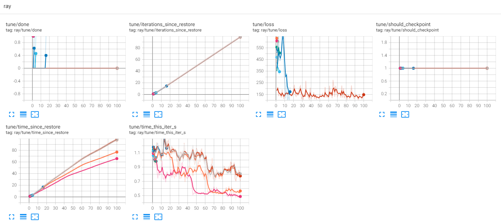

# Modelling of airBNB property listing dataset
## Overview
This project is a part of the data science project to predict the price of airBNB property listing. The initial target variable is price_per_night and the rest of the columns are the features. The dataset is cleaned and preprocessed before modelling. The modelling is done using classification, regression and neural network models. The best model is selected based on the performance metrics. The hyperparameter tuning is done using ray tune. The best model is then used to predict the price of the airBNB property listing. After that the frame work has been used to predict a different target "bedrooms".

## Directory structure
scripts folder has the necessary scripts to run the ML models on the data, utils folder has the util scripts required for data processing and model building and models folder has the best models and the parameters saved for a later use.

## Details of work done
- Processed and cleaned dataset using Pandas to improve data quality.
- Visually analysed the dataset to understand it better. 
- Trained, compared and evaluated machine learning models (Random Forest,
Linear/Logistic Regression, XGBoost etc) for classification (determining different
Airbnb categories) & regression (predicting tariff) use cases.
- Performed hyperparameter tuning and cross validation using GridSearchCV for ML to optimise the results for particular metrics,
- Ray Tune was used to perform hyper parameter tuning for neural networks
- Used Tensorboard to visualise the hyperparameter tuning results.
## How to run
modelling.py calls three scripts classification.py, regression.py and hyper_nn.py and runs the whole pipeline.
modelling_utils.py contains all the modelling related functions used in the scripts and eda_utils.py has other util functions. tabular_data.py does the cleaning
reuse_pipeline.py is used to test the automated framework for another target.
data_analysis.ipynb contains the initial exploratory data analysis, regression_results and classification_results notebook has analysis of the regression and classification results, respectively.

## Results
In this specific regression task, "Price_Night" was used as target and the results are below. "Category" column was used to test the classification task.

### Regression 
Metrics values and plots (scatter plots of actual and predicted values, residual plots and shapley value plots showing the impact of features on prediction)
```
mean_absolute_error: 37.52507797824936
mean_squared_error: 2376.7742701524608
root_mean_squared_error: 48.75217195318031
r2_score: -1.8189761527487125
```
<p>
  
   
  
</p>

### Classification
Metrics value and confusion matrix
```
Accuracy of best classification model on test data : 0.38235294117647056
Precision of best classification model on test data : 0.3814112766318649
Recall of best classification model on test data : 0.38235294117647056
F1 score of best classification model on test data : 0.38022412874614514

```
Confusion matrix

### Results of neural network modelling
Below are loss plot and parallel coordinates plot for hyperparameter tuning 
```
'test_mse_loss': 303.77952243829753, 
'test_mae_loss': 2.420852101053996, 
'test_r2_score': -0.21090976736368292, 
'inference_latency': 0.19866510000429116
```
Hyperparameter training in ray tune


Tensorboard plots
<p>
  
   
</p>


