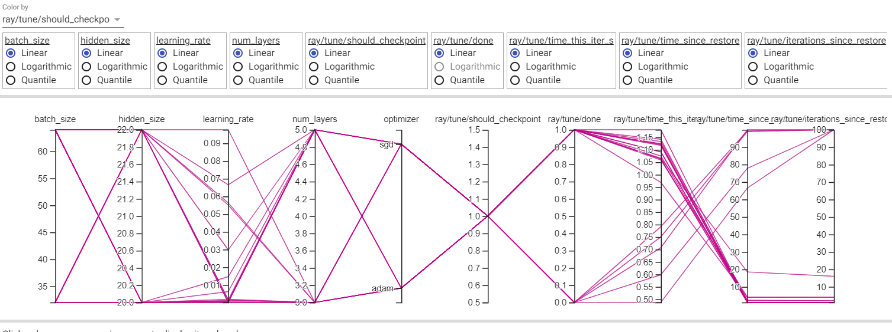

# Modelling of airBNB property listing dataset

# How to run

modelling.py calls three scripts classification.py, regression.py and hyper_nn.py and runs the whole pipeline.
modelling_utils.py contains all the modelling related functions used in the scripts and eda_utils.py has other util functions. tabular_data.py does the cleaning

# tensorboard images of hyper parameter tuning




```bash